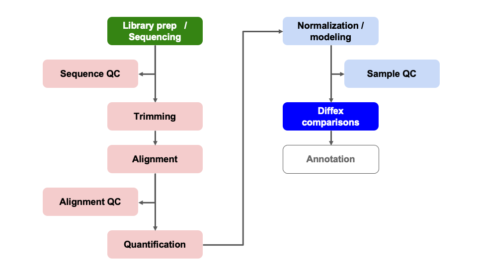
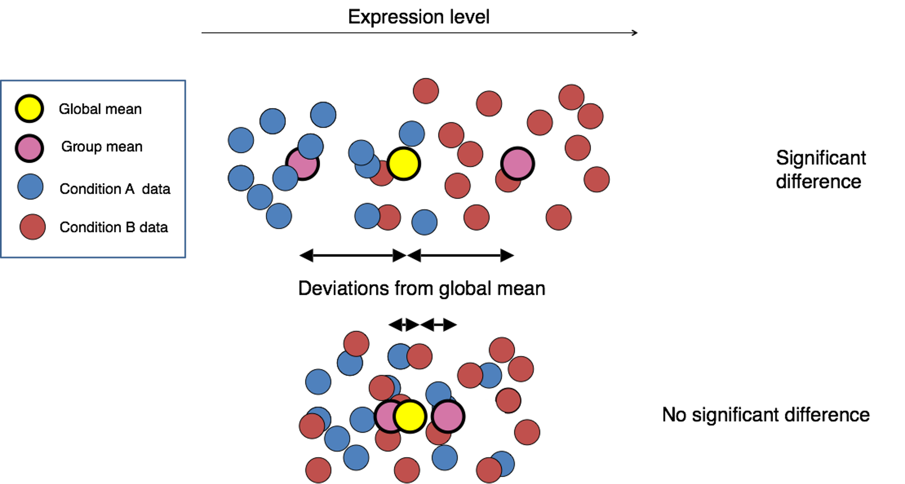

<style type="text/css">
body, td {
   font-size: 18px;
}
code.r{
  font-size: 12px;
}
pre {
  font-size: 12px
}
</style>

```{r, include = FALSE}
source("../bin/chunk-options.R")
knitr_fig_path("10-")
```

> # Objectives {.unlisted .unnumbered}
> * Generate tables of DE results
> * Understand what a p-value represents.
> * Understand multiple hypothesis correction application and importance


```{r Modules, eval=TRUE, echo=FALSE, message=FALSE, warning=FALSE}
library(DESeq2)
library(tidyr)
library(dplyr)
# load("rdata/RunningData.RData")
```

# Differential Expression Workflow {.unlisted .unnumbered}

Now we test for differential expression between our groups of interest and return a table of results.

{width=75%}

---

> # Question {.unlisted .unnumbered}
> Before we start, what do you think is the most challenging part of a differential expression analysis? Post in the thread on Slack.

# Generating DE results

Now that we have reviewed the plots by sample and determined that our data passed our quality control checks, specifically that the patterns we observe are likely due to our experimental treatments over technical or other confounding factors, we can focus on differential expression testing.

This illustration from the HCB training materials illustrates the basis of the differential expression procedure, where our goal is to compare the distribution of an expressed gene across samples in each treatment groups.


Only where the distributions of each group are sufficiently separated will a gene be considered differentially expressed. This is where having sufficient replicates to overcome within group variance is important, as the more replicates we have in each group the better we can determine the distributions of expression for each group.

## DESeq2 statistical testing

We have already fit our DESeq2 model, specifying our model as `~ condition` and our next step is to identify genes with significantly different expression between our contrasts of interest. To determine significance, a statistical test is required.

The first step for any statistical test is to define the *null hypothesis*. In this case, the null hypothesis would be that there is no difference in the expression of a gene between two groups of samples, such as illustrated at the bottom of the first figure in this module. The next step is to use a statistical test to determine if, based on the observed data, the null hypothesis can be rejected.

To do this, [DESeq2 applies the Wald test](http://bioconductor.org/packages/devel/bioc/vignettes/DESeq2/inst/doc/DESeq2.html#theory-behind-deseq2) to compare between two groups. A Wald test statistic is computed as well as the probability that the observed value or more extreme test statistic would be observed. This probability is called the p-value of the test.

If the p-value is smaller than a pre-defined threshold, we would reject the null hypothesis and state that there is evidence against the null, i.e. the gene is differentially expressed. However, if the p-value is larger than our threshold, we would *fail to reject* the null hypothesis, meaning that we lack evidence that the expression of this gene is different. Note, this is distinct from the assertion that the expression is the same in both groups.

For a more detailed overview of the statistical comparisons , please refer to [this HBC tutorial](https://hbctraining.github.io/DGE_workshop/lessons/05_DGE_DESeq2_analysis2.html) or the [DESeq2 vignette](http://bioconductor.org/packages/devel/bioc/vignettes/DESeq2/inst/doc/DESeq2.html#theory-behind-deseq2).

## Generating results

We can check what comparisons were automatically generated during fitting using the `resultsNames()` function.
```{r Results1}
resultsNames(dds)
```

There is only the one comparison in the results, so we will refer to it in the `name` parameter of the `results()` function, and assign the result as an object.

```{r SetsResult}
results_plus_vs_minus = results(dds, name = 'condition_plus_vs_minus')
head(results_plus_vs_minus)
```

In the results table, the row names are gene identifiers (in theis case ENSEMBL IDs because that's what the GTF we used in the call to RSEM+STAR used), and the columns have the following definitions:

1. `baseMean` is the average of the normalized count values, divided by size factors and taken over all samples, and can be interpreted as the relative expression level of that gene across all samples.
2. `log2FoldChange` is the log2 transformed ratio of the expression of the numerator group (first group) over the denominator group (second group after "vs"). Note that in our comparison, the `log2FoldChange` column compares the expression of the numerator group (`plus`) over the denominator group (`minus`). If the value is positive, that means the expression of that gene is greater across the `plus` samples than across the `minus` samples. If the value is negative, that means the expression of that gene is greater across the `minus` samples.
3. `lfcSE` is the standard error for the log2 fold change estimate.
4. `stat` is the calculated Wald statistic for that gene.
5. `pvalue` is the *nominal* significance for that gene.
6. `padj` is the *adjusted p-value* and is what we use for determining significantly differently expressed genes.

> # Note: `results()` defaults {.unlisted .unnumbered}
> If no arguments are passed to `results()`, then the log2 fold changes and Wald test p-value will be for the **last variable** in the design formula, and if this is a factor, the comparison will be the **last level** over the **reference level**. If you specify `name`, as we did above, then the behavior is given by the name used from `resultsNames()`.

There are multiple ways to specify the test to be done using the `results()` function. It is especially helpful to know this when fitting more complex models and testing more complex contrasts. To demonstrate this, consider this description from the help for `results()`:

> `contrast`: a character vector with exactly three elements: the name of a factor in the design formula, the name of the numerator level for the fold change, and the name of the denominator level for the fold change

So an alternative way to test the same contrast as above (i.e. `plus` / `minus`) is:

```{r SetsResultsAlt}
alt_results_plus_vs_minus = results(dds, contrast = c('condition', 'plus', 'minus'))
head(alt_results_plus_vs_minus)
```

This way of calling `results()` is especially helpful when the levels of the column of interest contain more than two levels because you can specify exactly which levels to test with little confusion.

> # Question {.unlisted .unnumbered}
> Why should we use values from this column instead of the 'pvalue' column? Post in the Slack thread.

### Multiple hypothesis testing and FDR correction

Each p-value is the result of a single test for a single gene. If we used the p-value directly from the Wald test with a significance cut-off of p < 0.05, that means there is a 5% chance it is a false positives.

The more genes we test, the greater chance we have of seeing a significant results. So if we are testing 20,000 genes for differential expression, we would expect to see ~1,000 significant genes just by chance.

This is the multiple testing problem and is problematic because we would need to sift through our “significant” genes to identify which ones are true positives.

To address this we need to correct for [multiple hypothesis testing](https://multithreaded.stitchfix.com/blog/2015/10/15/multiple-hypothesis-testing/) to reduce the number of false positives, and while there are a few common approaches, the default method is False Discovery Rate(FDR) (aka: Benjamini-Hochberg correction) which is symbolized as 'BH' in DESeq2.

[Benjamini and Hochberg (1995)](https://rss.onlinelibrary.wiley.com/doi/10.1111/j.2517-6161.1995.tb02031.x) defined the concept of FDR and created an algorithm to control it below a specified level. An interpretation of the BH method is implemented in DESeq2 in which genes are ranked by p-value, then each ranked p-value is multiplied by the number of total tests divided by rank.

**Note**: From the `results` function help page and [HBC tutorial that includes overview of multiple hypothesis correction](https://hbctraining.github.io/DGE_workshop/lessons/05_DGE_DESeq2_analysis2.html), we can change the multiple hypothesis correction method to an alternative option using the `pAdjustMethod =` argument.

The default FDR rate cutoff for DESeq2 is `alpha = 0.05`. By setting the cutoff to < 0.05, we expect that the proportion of false positives amongst our differentially expressed genes is now controlled to 5%. For example, if we call 500 genes as differentially expressed with this FDR cutoff, we expect only 25 of them to be false positives. DESeq2 vignette's includes a [further discussion of filtering and multiple testing](http://bioconductor.org/packages/devel/bioc/vignettes/DESeq2/inst/doc/DESeq2.html#independent-filtering-and-multiple-testing)

> # Note on `padj` values set to NA {.unlisted .unnumbered}
>
> As discussed in the [HBC tutorial](https://hbctraining.github.io/DGE_workshop/lessons/05_DGE_DESeq2_analysis2.html) as well as the [DESeq2 vignette](http://bioconductor.org/packages/devel/bioc/vignettes/DESeq2/inst/doc/DESeq2.html#i-want-to-benchmark-deseq2-comparing-to-other-de-tools.), DESeq2 reduces the number of genes that will be tested by removing genes with low number of counts and outlier samples.
>
> * If within a row, all samples have zero counts, the baseMean column will be zero, and the log2 fold change estimates, p-value and adjusted p-value will all be set to NA.
> * If a row contains a sample with an extreme count outlier then the p-value and adjusted p-value will be set to NA. These outlier counts are detected by [Cook’s distance](https://en.wikipedia.org/wiki/Cook%27s_distance).
> * If a row is filtered by automatic independent filtering, e.g. for having a low mean normalized count, then only the adjusted p-value will be set to NA.

Now that we've generated our differential comparisons and have an understanding of our results, including multiple hypothesis correction, we can proceed with generating summary figures and tables for our differential expression analysis.

---

# Summary

In this section, we:

* Performed statistical tests for comparisons of interest
* Generated tables of differential expression results - i.e. fold changes and adjusted pvalues for each gene in dataset
* Discussed importance and application of multiple hypothesis correction

Now that we've generated our differential comparisons and have an understanding of our results, including multiple hypothesis correction, we can proceed with generating summary figures and tables for our differential expression analysis.

---

# Sources

* HBC DGE training module, part 1: https://hbctraining.github.io/DGE_workshop/lessons/04_DGE_DESeq2_analysis.html
* HBC DGE training module, part 2: https://hbctraining.github.io/DGE_workshop/lessons/05_DGE_DESeq2_analysis2.html
* DESeq2 vignette: http://bioconductor.org/packages/devel/bioc/vignettes/DESeq2/inst/doc/DESeq2.html#differential-expression-analysis

---


```{r WriteOut.RData, eval=TRUE, echo=FALSE, message=FALSE, warning=FALSE}
# Hidden code block to write out data for knitting
# save.image(file = "rdata/RunningData.RData")
```

---

These materials have been adapted and extended from materials listed above. These are open access materials distributed under the terms of the [Creative Commons Attribution license (CC BY 4.0)](http://creativecommons.org/licenses/by/4.0/), which permits unrestricted use, distribution, and reproduction in any medium, provided the original author and source are credited.
